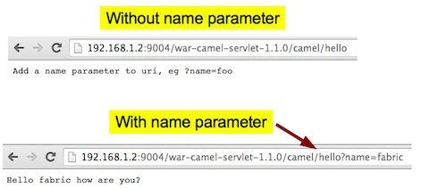

# Camel Servlet QuickStart

This example demonstrates how you can use Servlet to expose a http
service in a Camel route, and run that in a servlet container such as
Apache Tomcat. 

The Camel route is illustrated in the figure below. The
`servlet:hello` endpoint is listening for HTTP requests, and being
routed using the Content Based Router.

The request is being routed whether or not there is a HTTP query
parameter with the name `name`. This is best illustrated as in the
figure below, where we are running this quickstart. The first attempt
there is no `name` parameter, and Camel returns a message that
explains to the user, to add the parameter. In the send attempt we
provide `?name=fabric` in the HTTP url, and Camel responses with a
greeting message. 

# Building this example

Building and running this quickstart consists of three steps:

## Building

Run the following:

    mvn fabric8:run
    
then click the URL you see in the output log    
